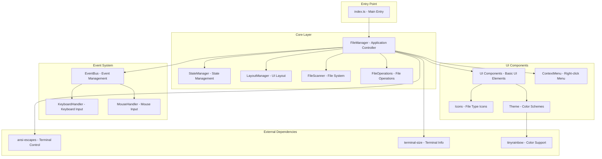
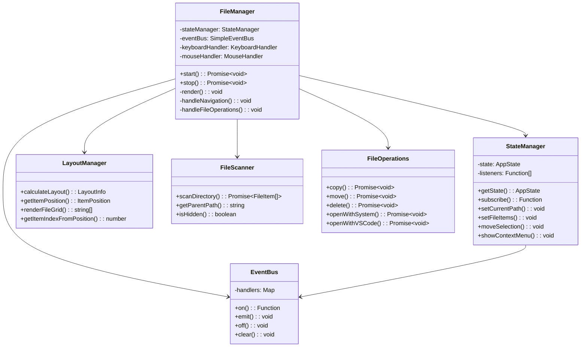
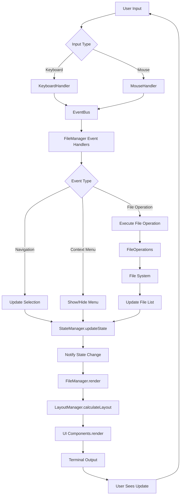

# Mimic Window - 架构设计与实现说明

## 项目概述

**Mimic Window** 是一个基于终端的文件管理器，使用 ASCII 字符模拟图形界面文件管理器的外观。项目采用 TypeScript 开发，使用函数式和面向对象混合的设计模式，实现了一个功能完整、响应式的终端 UI 应用。

### 核心特点

- 🎨 ASCII 艺术风格的图形界面
- ⌨️ 完整的键盘快捷键支持
- 🖱️ 鼠标交互支持
- 📁 文件和目录的基本操作
- 🎯 响应式布局设计
- 🔄 实时状态管理

---

## 技术架构

### 整体架构图



### 组件关系图



### 数据流图



---

## 核心模块详解

### 1. FileManager (应用控制器)

**职责**: 应用程序的主控制器，协调所有子系统的工作。

**核心功能**:

- 应用生命周期管理 (启动/停止)
- 终端环境初始化和清理
- 事件系统协调
- 渲染循环管理
- 用户交互处理

**关键特性**:

```typescript
// 渲染循环 - 20 FPS
private startRenderLoop(): void {
    this.render();
    this.renderTimer = setInterval(() => {
        this.render();
    }, 50); // 20 FPS
}

// 事件处理流水线
private setupEventHandlers(): void {
    this.eventBus.on(Events.NAVIGATION, async (event) => {
        await this.handleNavigation(event.direction);
    });
    // ... 其他事件处理器
}
```

### 2. StateManager (状态管理器)

**职责**: 采用函数式状态管理模式，确保状态的不可变性和可预测性。

**核心设计**:

- **不可变状态更新**: 每次状态变更都创建新的状态对象
- **观察者模式**: 支持状态变化的订阅和通知
- **类型安全**: 完整的 TypeScript 类型定义

**状态结构**:

```typescript
interface AppState {
  viewport: {
    currentPath: string;
    items: FileItem[];
    terminalSize: Size;
    itemsPerRow: number;
    totalRows: number;
  };
  selection: {
    selectedIndex: number;
    selectedItem: FileItem | null;
  };
  contextMenu: {
    visible: boolean;
    position: Position;
    targetItem: FileItem | null;
  };
  clipboard: FileItem | null;
  clipboardOperation: 'copy' | 'cut' | null;
}
```

### 3. 事件系统 (EventBus + Handlers)

**设计理念**: 解耦的事件驱动架构，支持键盘和鼠标输入的统一处理。

**组件构成**:

- **EventBus**: 简单高效的发布-订阅模式实现
- **KeyboardHandler**: 键盘输入处理和快捷键映射
- **MouseHandler**: 鼠标事件处理和位置计算

**事件类型**:

```typescript
export const Events = {
  // Mouse events
  MOUSE_CLICK: 'mouse:click',
  MOUSE_DOUBLE_CLICK: 'mouse:double-click',
  MOUSE_RIGHT_CLICK: 'mouse:right-click',

  // Navigation events
  NAVIGATION: 'navigation',

  // File events
  FILE_OPENED: 'file:opened',
  FILE_COPY: 'file:copy',
  FILE_PASTE: 'file:paste',
  FILE_DELETE: 'file:delete',

  // Context menu events
  CONTEXT_MENU_ACTION: 'context-menu:action',
};
```

### 4. LayoutManager (布局管理器)

**职责**: 负责终端界面的布局计算和文件网格的渲染。

**核心算法**:

```typescript
// 布局计算
static calculateLayout(terminalSize: Size): LayoutInfo {
    const availableWidth = terminalSize.width - 4; // 边框占用
    const availableHeight = terminalSize.height - HEADER_HEIGHT - FOOTER_HEIGHT - 2;

    const itemsPerRow = Math.max(
        MIN_ITEMS_PER_ROW,
        Math.floor(availableWidth / ITEM_WIDTH)
    );

    const totalRows = Math.max(1, Math.floor(availableHeight / ITEM_HEIGHT));

    return { itemsPerRow, totalRows, itemWidth, itemHeight, startY };
}
```

**响应式设计**:

- 自动适应终端大小变化
- 动态计算文件图标的行列布局
- 精确的鼠标点击位置映射

### 5. FileScanner (文件系统扫描器)

**职责**: 文件系统的抽象层，提供跨平台的文件操作接口。

**功能特性**:

- 异步目录扫描
- 文件类型识别
- 隐藏文件过滤
- 路径规范化处理

### 6. UI 组件系统

**模块化设计**: 每个 UI 组件都是独立的函数，便于测试和复用。

**组件类别**:

- **基础 UI** (`ui.ts`): 路径栏、状态栏、窗口框架
- **上下文菜单** (`context-menu.ts`): 右键菜单系统
- **图标系统** (`icons.ts`): 文件类型图标和文本处理
- **主题系统** (`theme.ts`): 颜色方案和样式定义

---

## 实现特征

### 1. 终端控制技术

**ANSI 转义序列**: 使用 `ansi-escapes` 库进行精确的终端控制。

```typescript
// 终端初始化
private initializeTerminal(): void {
    process.stdout.write(ansiEscapes.cursorHide);        // 隐藏光标
    process.stdout.write(ansiEscapes.clearScreen);       // 清屏
    process.stdout.write('\x1b[?1049h');                // 启用备用屏幕缓冲区
}

// 终端清理
private cleanupTerminal(): void {
    process.stdout.write('\x1b[?1049l');                // 禁用备用屏幕缓冲区
    process.stdout.write(ansiEscapes.cursorShow);        // 显示光标
    process.stdout.write(ansiEscapes.clearScreen);       // 清屏
}
```

### 2. 响应式 UI 渲染

**虚拟窗口系统**: 模拟桌面应用的窗口边框和布局。

```typescript
// 窗口框架渲染
export function createWindowFrame(width: number, height: number, title: string) {
  const titleBar = `╭─ ${title} ${'─'.repeat(width - title.length - 6)}╮`;
  const bottomBar = `╰${'─'.repeat(width - 2)}╯`;

  return { top: titleBar, bottom: bottomBar };
}
```

**ASCII 艺术图标**: 为不同文件类型设计的 ASCII 图标系统。

```typescript
// 文件图标映射
const FILE_ICONS = {
  directory: ['📁', '   ', '   '],
  text: ['📄', '   ', '   '],
  image: ['🖼️ ', '   ', '   '],
  code: ['💻', '   ', '   '],
  // ... 更多类型
};
```

### 3. 交互设计

**多模式输入支持**:

- **键盘导航**: 方向键、Enter、退格键等
- **鼠标操作**: 点击选择、双击打开、右键菜单
- **快捷键系统**: Ctrl+C/V/X 等标准快捷键

**上下文感知菜单**:

```typescript
// 动态菜单生成
if (targetItem.type === 'directory') {
  menuItems = getDirectoryContextMenuItems();
} else {
  menuItems = getFileContextMenuItems();
}
```

### 4. 性能优化

**事件驱动渲染**: 采用事件触发的渲染机制，避免不必要的重绘。

```typescript
// 事件驱动渲染 - 替代了 20 FPS 的固定渲染循环
// 渲染仅在以下情况触发：
// 1. 鼠标点击事件
// 2. 键盘按键事件
// 3. 终端大小变化
// 4. 文件操作完成
// 5. 状态变化
this.stateManager.subscribe(() => {
  this.render(); // 仅在状态变化时渲染
});
```

**增量渲染**: 只在状态变化时重新渲染界面。

```typescript
// 状态订阅模式
this.stateManager.subscribe(() => {
  this.render(); // 仅在状态变化时渲染
});
```

**布局缓存**: 避免重复的布局计算。

```typescript
// 布局信息缓存在状态中
this.stateManager.setLayoutInfo(layout.itemsPerRow, layout.totalRows);
```

### 5. 错误处理和稳定性

**优雅降级**: 在各个层面实现错误处理。

```typescript
// 文件操作错误处理
try {
  await FileOperations.openWithSystem(selectedItem.path);
} catch (error) {
  console.error('Failed to open item:', error);
  // 用户友好的错误提示
}
```

**资源清理**: 确保应用退出时正确清理资源。

```typescript
// 优雅关闭处理
const shutdown = async () => {
  console.log('\n👋 Shutting down...');
  await fileManager.stop();
  process.exit(0);
};

process.on('SIGINT', shutdown);
process.on('SIGTERM', shutdown);
```

---

## 技术栈选择

### 开发语言和运行时

- **TypeScript 5.9+**: 提供类型安全和现代 JavaScript 特性
- **Node.js**: 跨平台运行时环境
- **ESM 模块系统**: 现代模块化架构

### 构建工具链

- **Rollup**: 高效的模块打包器，支持多格式输出
- **TypeScript Compiler**: 类型检查和代码转换
- **Vitest**: 快速的单元测试框架
- **OXLint**: 高性能的代码检查工具

### 核心依赖

- **ansi-escapes**: 终端控制序列库
- **terminal-size**: 终端尺寸检测
- **tinyrainbow**: 轻量级颜色库

### 开发体验

- **pnpm**: 快速的包管理器
- **tsx**: TypeScript 文件直接执行
- **热重载**: 开发时的自动重启

---

## 设计模式应用

### 1. 观察者模式 (Observer Pattern)

- **StateManager** 的状态订阅机制
- **EventBus** 的事件发布-订阅系统

### 2. 策略模式 (Strategy Pattern)

- 不同文件类型的图标渲染策略
- 多种输入处理策略 (键盘/鼠标)

### 3. 工厂模式 (Factory Pattern)

- UI 组件的创建函数
- 上下文菜单的动态生成

### 4. 单例模式 (Singleton Pattern)

- **FileManager** 作为应用的单一入口点
- **EventBus** 作为全局事件中心

### 5. 命令模式 (Command Pattern)

- 文件操作的封装 (复制、移动、删除)
- 撤销/重做功能的基础

---

## 扩展性设计

### 1. 插件架构潜力

当前架构为插件系统提供了良好的基础：

- 事件系统可以支持外部插件的事件监听
- UI 组件系统支持自定义组件的注入
- 文件操作接口可以扩展支持新的操作类型

### 2. 主题系统

- 模块化的颜色和样式管理
- 支持运行时主题切换
- 可扩展的图标系统

### 3. 国际化支持

- 文本内容的抽象化
- 多语言界面的基础架构
- 可配置的日期和数字格式

---

## 总结

**Mimic Window** 项目展现了在终端环境中实现复杂图形界面的巧妙方法。通过精心设计的架构，项目成功地在字符界面中重现了现代文件管理器的用户体验。

**关键成就**:

1. **创新的 UI 设计**: 在纯文本环境中实现类图形界面的交互体验
2. **健壮的架构**: 模块化、可测试、可扩展的代码组织
3. **高性能渲染**: 优化的渲染循环和增量更新机制
4. **完整的交互支持**: 键盘和鼠标的全面支持
5. **跨平台兼容**: 基于标准终端特性的实现

这个项目不仅是一个实用的文件管理工具，更是终端 UI 开发技术的优秀示范，为类似的终端应用开发提供了宝贵的参考。
